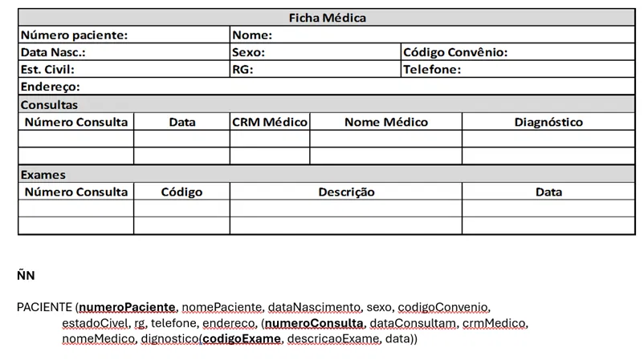
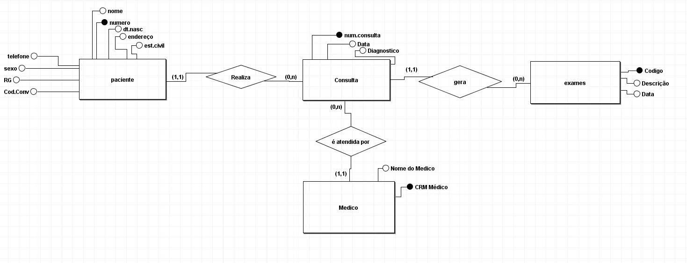

<h1>Instruções</h1>
<h3>Aplicando os conceitos desenvolvidos em aula, crie o DER e posteriormente aplique as formas normais.</h3>

<h1>Reresolução do exercício</h1>

<h3>DER(BRmodelo)</h3>

<h3>Normalização</h3>

0FN
PACIENTE (numeroPaciente, nomePaciente, dataNascimento, sexo, codigoConvenio,
estadoCivil, rg, telefone, endereco,(numeroConsulta, dataConsulta,
crmMedico, nomeMedico, diagnostico,(codigoExame, descricaoExame, data)))
