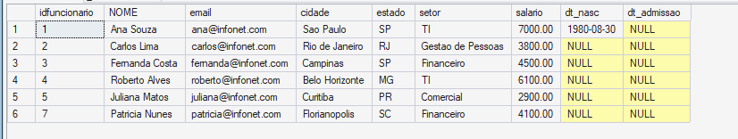

## Etapa 1 - Alterar a tabela "Funcionarios" adicionando data de nascimento e data de admissão dos funcionários 
### Primeiro passo - adicionar colunas dt_nasc e dt_admissao
```sql
 alter table funcionarios add dt_nasc date , dt_admissao date 
```


---

### Segundo passo - adicionar dados
```sql
update funcionarios set dt_nasc = '30/08/1980' , dt_admissao = '01/07/2015' where idfuncionario = 001; 
update funcionarios set dt_nasc = '13/10/1979' , dt_admissao = '13/12/2010' where idfuncionario = 002; 
update funcionarios set dt_nasc = '04/11/1990' , dt_admissao = '06/03/2018' where idfuncionario = 003; 
update funcionarios set dt_nasc = '05/10/2000' , dt_admissao = '01/07/2020' where idfuncionario = 004; 
update funcionarios set dt_nasc = '27/02/1994' , dt_admissao = '29/08/2025' where idfuncionario = 005; 
update funcionarios set dt_nasc = '17/04/1987' , dt_admissao = '06/07/2019' where idfuncionario = 007;
```
---
###
