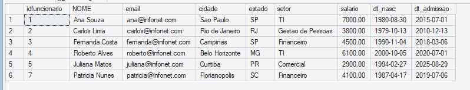
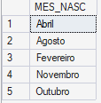
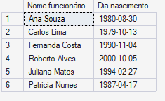
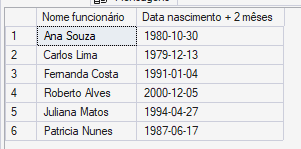
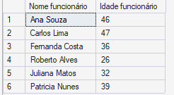
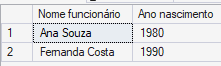
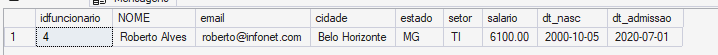
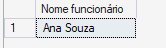

## Etapa 1 - Alterar a tabela "Funcionarios" adicionando data de nascimento e data de admissão dos funcionários 
### Primeiro passo - adicionar colunas dt_nasc e dt_admissao
```sql
alter table funcionarios add dt_nasc date , dt_admissao date 
```


---

### Segundo passo - adicionar dados
```sql
update funcionarios set dt_nasc = '30/08/1980' , dt_admissao = '01/07/2015' where idfuncionario = 001; 
update funcionarios set dt_nasc = '13/10/1979' , dt_admissao = '13/12/2010' where idfuncionario = 002; 
update funcionarios set dt_nasc = '04/11/1990' , dt_admissao = '06/03/2018' where idfuncionario = 003; 
update funcionarios set dt_nasc = '05/10/2000' , dt_admissao = '01/07/2020' where idfuncionario = 004; 
update funcionarios set dt_nasc = '27/02/1994' , dt_admissao = '29/08/2025' where idfuncionario = 005; 
update funcionarios set dt_nasc = '17/04/1987' , dt_admissao = '06/07/2019' where idfuncionario = 007;
```



---

## Etapa 2 - Exiba o nome dos meses da data de nascimento dos funcionários sem repeti-los e ordenados. (Ordenei por ordem alfabetica)

```sql
SELECT DISTINCT DATENAME(MONTH, dt_nasc ) as "mês nascimento"
from funcionarios
order by DATENAME(MONTH, dt_nasc )
```



---

## Etapa 3 - Exiba idFuncionario e de todos os funcionários que nasceram em 2007. 

```sql
SELECT idfuncionario
FROM Funcionarios
WHERE YEAR(dt_nasc) = 2007;
```
Na minha tabela, este SELECT não deu nenhum resultado, pois não tem nenhum funcionário que nasceu em 2007.

---

## Etapa 4 - Exiba nome e dia de nascimento dos funcionários que nasceram em abril de 2008. 

```sql
SELECT NOME as "Nome funcionário" , day (dt_nasc) as "Dia nascimento"
from funcionarios
where year (dt_nasc) = 2008 and month (dt_nasc) = 4	
```
Na minha tabela, este SELECT não deu nenhum resultado, pois não tem nenhum funcionário que nasceu em abril de 2008.

---

## Etapa 5 - Exiba o nome e a data de nascimento dos funcionários, acrescida de 2 meses.

```sql
SELECT NOME as "Nome funcionário" , DATEADD (month , 2 ,dt_nasc) as "Data nascimento + 2 mêses"
from funcionarios
```
### Antes



### Depois



---

## Etapa 6 - Exiba o nome e a idade dos funcionários, calculando a idade em relação à data de nascimento e à data de hoje. 

```sql
SELECT NOME as "Nome funcionário" , DATEDIFF (YEAR , dt_nasc ,GETDATE() ) as "Idade funcionário"
From funcionarios
```


---

## Etapa 7 - Exiba o idFuncionario, nome e ano de nascimento dos funcionários que nasceram entre março e maio de 2000.

```sql
select idfuncionario , NOME as "Nome funcionário" , year (dt_nasc) as "Data nascimento"
from funcionarios
where month(dt_nasc) BETWEEN 3 AND 5 and year (dt_nasc) = 2000
```
Na minha tabela, este SELECT não deu nenhum resultado, pois não tem nenhum funcionário que nasceu entre março e maio de 2000.

---

## Etapa 8 - Exiba o nome e o ano de nascimento dos funcionários do estado de SP. 

```sql
select NOME as "Nome funcionário" , year (dt_nasc) as "Data nascimento"
from funcionarios
where estado = 'SP'
```


---

## Etapa 9 - Exiba nome e data de nascimento dos funcionários que nasceram antes de 2005. 

```sql
select NOME as "Nome funcionário" , dt_nasc as "Data nascimento"
from funcionarios
where year (dt_nasc) < 2005
```


---

## Etapa 10 - Exiba cidade e estado dos funcionários que nasceram após 2002, sem repetir os dados. 

```sql
select DISTINCT cidade as "Cidade funcionário" , estado "Estado funcionário"
from funcionarios
where year (dt_nasc) > 2002
```
Na minha tabela, este SELECT não deu nenhum resultado, pois não tem nenhum funcionário que nasceu após 2002.

---

## Etapa 11 - Exiba todos os dados dos funcionários que nasceram nos anos de 2000 e 2004. 

```sql
select *
from funcionarios
where year (dt_nasc) in ( 2000 , 2004 )
```


---

## Etapa 12 - Exiba nome dos funcionários que nasceram no dia 30. 

```sql
select NOME as "Nome funcionário"
from funcionarios
where day (dt_nasc) = 30
```
