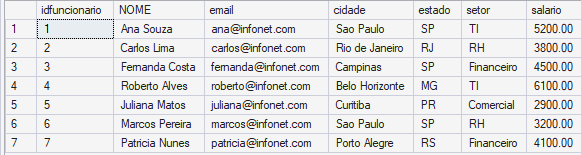
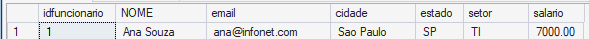

## Etapa 1 - Criar Banco de dados
CREATE DATABASE bd_infonet  
## Etapa 2 - Usar o bd_infonet como banco de dados
use bd_infonet
## Etapa 3 - Criar tabela
CREATE TABLE funcionarios(  
idfuncionario INT PRIMARY KEY, 
NOME varCHAR(100) not null,	 
email varchar (150) not null UNIQUE, 
cidade varchar (100) not null, 
estado char (2) not null, 
setor varchar (80) not null, 
salario decimal(10,2) not null); 

## Etapa 4 - Cadastrar funcionários 
select * from funcionarios 
	insert into funcionarios values (1,'Ana Souza', 'ana@infonet.com', 'Sao Paulo', 'SP', 'TI', 5200.00); 
	insert into funcionarios (idfuncionario, NOME, email, cidade, estado, setor, salario) 
values 
(2,'Carlos Lima', 'carlos@infonet.com', 'Rio de Janeiro', 'RJ', 'RH', 3800.00), 
(3,'Fernanda Costa', 'fernanda@infonet.com', 'Campinas', 'SP', 'Financeiro', 4500.00), 
(4,'Roberto Alves', 'roberto@infonet.com', 'Belo Horizonte', 'MG', 'TI', 6100.00), 
(5,'Juliana Matos', 'juliana@infonet.com', 'Curitiba', 'PR', 'Comercial', 2900.00), 
(6,'Marcos Pereira', 'marcos@infonet.com', 'Sao Paulo', 'SP', 'RH', 3200.00), 
(7,'Patricia Nunes', 'patricia@infonet.com', 'Porto Alegre', 'RS', 'Financeiro', 4100.00); 

## Etapa 5 - Aumentar salario da Ana
update funcionarios set salario = 7000 where idfuncionario = 1; 

